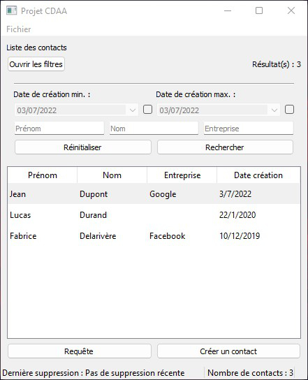
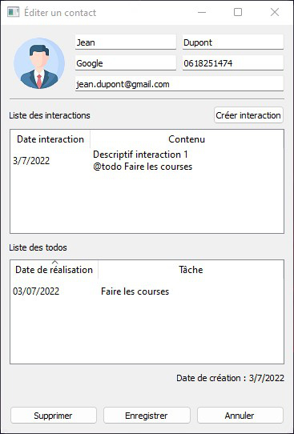

<div id="top"></div>

<!-- PROJECT LOGO -->
<br />
<div align="center">
  <h3 align="center">Contact Manager</h3>
  <p align="center">
    <a href="#">View Demo (TODO)</a> ·
    <a href="https://github.com/Akwd22/contact-manager/releases/latest">Get latest release</a>
  </p>
</div>

<!-- TABLE OF CONTENTS -->
<details>
  <summary>Table of Contents</summary>
  <ol>
    <li><a href="#about-the-project">About The Project</a></li>
    <li><a href="#context">Context</a></li>
    <li><a href="#built-with">Built With</a></li>
    <li><a href="#documentation">Documentation</a></li>
    <li><a href="#getting-started">Getting Started</a></li>
    <li><a href="#contributors">Contributors</a></li>
  </ol>
</details>

<!-- ABOUT THE PROJECT -->
## About The Project

<div align="center">
  
  
</div>
<br />

This project principle is simple: an application to manage a list of contacts and their interactions such as todos. This application could be used in  a company context for example.

### Features

- [x] Manage a list of contacts (name, email, company, etc.).
- [x] Manage the tasks of a contact (description, deadline).
- [x] Find contacts with multiple search filters.
- [x] Perform an advanced search with a query system.
- [x] Export contacts in JSON format.

<p align="right">(<a href="#top">back to top</a>)</p>

<!-- CONTEXT -->
## Context

This project is an academic project made during the **third year** of a **Bachelor** of Computer Science.  
The development was done by 2 people.

<p align="right">(<a href="#top">back to top</a>)</p>

<!-- BUILT WITH -->
## Built With

Entire project was built with C++ for the business layer and [Qt](https://www.qt.io/) for the storage and UI layers. Database used is [SQLite](https://www.sqlite.org/index.html).

<p align="right">(<a href="#top">back to top</a>)</p>

<!-- DOCUMENTATION -->
## Documentation

You can find documentation files such as the requirements analysis, UML diagrams in the folder `docs/`.  
Doxygen docs can be generated in HTML with script file `doxy/run_doxygen` ([Doxygen](https://doxygen.nl/) must be installed on your system).

<p align="right">(<a href="#top">back to top</a>)</p>

<!-- GETTING STARTED -->
## Getting Started

If you are on Windows x64, and don't want to compile, you can [get latest binaries](https://github.com/Akwd22/contact-manager/releases/latest) and skip the next steps.  
Anyways, to get a local copy up and running follow the steps:

### Prerequisites

To setup the project, you will need:
* [Qt 5.0+](https://www.qt.io/)

### Installation

1. Clone the repo:
   ```sh
   git clone https://github.com/Akwd22/contact-manager.git
   ```
2. Compile the project, you have two choices:
   - From command-line:
     ```sh
     cd src
     qmake
     make <debug|release>
     ```
     Then, go to `src/out/<debug|release>` and run `ui` executable to run the app, or `test_logic` if you want to run unit tests.
     
   - From Qt Creator: import the project file `src/main.pro` with default settings, and you should be good.

<p align="right">(<a href="#top">back to top</a>)</p>

<!-- Contributors -->
## Contributors

This project was made by:
- [Eddy D.](https://github.com/Akwd22)
- [Clément G.](https://github.com/Zoreph22)

<p align="right">(<a href="#top">back to top</a>)</p>
